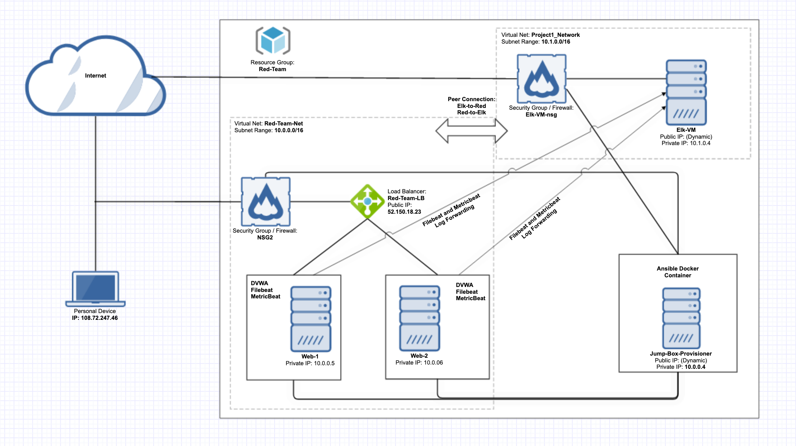
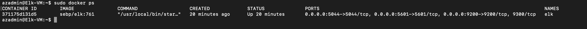

## Automated ELK Stack Deployment

The files in this repository were used to configure the network depicted below.



These files have been tested and used to generate a live ELK deployment on Azure. They can be used to either recreate the entire deployment pictured above. Alternatively, select portions of the playbook file may be used to install only certain pieces of it, such as Filebeat.

  - Playbook for Web VM Config with Docker: [pentest.yml](ansible_playbooks/pentest.yml)
  - Playbook for Installing ELK on a VM: [install-elk.yml](ansible_playbooks/install-elk.yml)
  - Playbook for Installing Filebeat on the Elk-VM: [filebeat-playbook.yml](ansible_playbooks/filebeat-playbook.yml)
  - Playbook for Installing Metricbeat on Elk-VM: [metricbeat-playbook.yml](ansible_playbooks/metricbeat-playbook.yml)

This document contains the following details:
- Description of the Topology
- Access Policies
- ELK Configuration
  - Beats in Use
  - Machines Being Monitored
- How to Use the Ansible Build


### Description of the Topology

The main purpose of this network is to expose a load-balanced and monitored instance of DVWA, the D*mn Vulnerable Web Application.

Load balancing ensures that the application will be highly available, in addition to restricting access to the network.
- The aspect of security that load balancers protect is **availability**, because it allows incoming client requests to be distributed to more than one server.  
- By utilizing a jump box, the attack surface will be minimized. All remote connections to the cloud are forced to route through a single virtual machine, which is much easier to manage if you have to scale up your network size. 

Integrating an ELK server allows users to easily monitor the vulnerable VMs for changes to the configuration and system files.
- Filebeat harvests and forwards log files to the server instance of ELK. This provides good visibility into what types of events have happened to a VM. 
- Metricbeat collects metrics from the operating system and from services running on the VM and then forwards them to the appropriate ELK server or instance.

The configuration details of each machine may be found below.

| Name                 | Function   | IP Address | Operating System     |
|----------------------|------------|------------|----------------------|
| Jump-Box-Provisioner | Gateway    | 10.0.0.4   | Linux (ubuntu 18.04) |
| Web-1                | DVWA       | 10.0.0.5   | Linux (ubuntu 18.04) |
| Web-2                | DVWA       | 10.0.0.6   | Linux (ubuntu 18.04) |
| Elk-VM               | ELK Server | 10.1.0.4   | Linux (ubuntu 18.04) |

### Access Policies

The machines on the internal network are not exposed to the public Internet. 

Only the Jump-Box-Provisioner machine can accept connections from the Internet. Access to this machine is only allowed from the following IP addresses:
-  128.61.67.136

Machines within the network can only be accessed by the Jump-Box-Provisioner.
- The Jump-Box-Provisioner is permitted access to Elk-VM through SSH using the IP address of the Jump-Box-Provisioner, which is ```10.0.0.4.```
A summary of the access policies in place can be found in the table below.

| Name                 | Publicly Accessible | Allowed IP Addresses                        |
|----------------------|---------------------|---------------------------------------------|
| Jump-Box-Provisioner | Yes                 | 128.61.67.136:22 10.0.0.5 10.0.0.6 10.1.0.4 |
| Web-1                | No                  | 10.0.0.4:80                                 |
| Web-2                | No                  | 10.0.0.4:80                                 |
| Elk-VM               | Yes                 | 23.99.12.39:5601 10.0.0.4                   |

### Elk Configuration

Ansible was used to automate configuration of the ELK machine. No configuration was performed manually, which is advantageous because...
- using an ansible playbook helps you scale your network up by being a consistent method of configuration, 
- it can also help minimize a networks attack surface by enabling you to re-configure a large number of devices within a small time frame.

The install-elk.yml playbook implements the following tasks:
- Install Docker.io and Docker Module
- Install python3-pip
- Increases the virtual memory of the Elk-VM
- Launches a docker container module to run on the Elk ports
- Ensures that docker starts on boot

The following screenshot displays the result of running `docker ps` after successfully configuring the ELK instance.



### Target Machines & Beats
This ELK server is configured to monitor the following machines:
- Web-1: 10.0.0.5
- Web-2: 10.0.0.6

We have installed the following Beats on these machines:
- Filebeat
- Metricbeat

These Beats allow us to collect the following information from each machine:
- Filebeat monitors the log files or locations that you specify, collects log events, and forwards them either to Elasticsearch or Logstash for indexing.
- Metricbeat reports on system-level CPU usage, memory, file system, disk IO, and network IO statistics. 
For example, Metricbeat would capture and forward MySQL server status metrics, such as what queries have been made and how many times.

### Using the ELK Playbook
In order to use the ELK playbook, you will need to have an Ansible control node already configured: in our case, it is the Jump Box Provisioner. Assuming you have such a control node provisioned: 

SSH into the control node and follow the steps below:
- Copy the playbook file to the Ansible Docker Container.
- Update the ansible hosts `/etc/ansible/hosts` file to include the IP number for the Elk-VM:
```
[elk]
10.1.0.4 ansible_python_interpreter=/usr/bin/python3
```
- Run the playbook using `ansible-playbook /etc/ansible/install-elk.yml` on the Ansible Docker Container.
- To make Ansible run the playbook on a specific machine or group you want to specify `hosts: elk` in the header, this references the Ansible host file at `/etc./ansible/hosts`:
```
---
- name: Configure Elk VM with Docker
  hosts: elk
  remote_user: azadmin
  become: true
  tasks:
```
- In order to specify which machine to install the ELK server on versus which to install Filebeat on, we have two seperate playbooks. The install-elk.yml file specifically handles installing an instance of Elasticstash, as opposed to the filebeat-playbook.yml that specifically installs Filebeat on the Web-1 and 2 VM.
- Navigate to `http://<Elk-VM IP>:5601/app/kibana` to check that the installation worked as expected.
